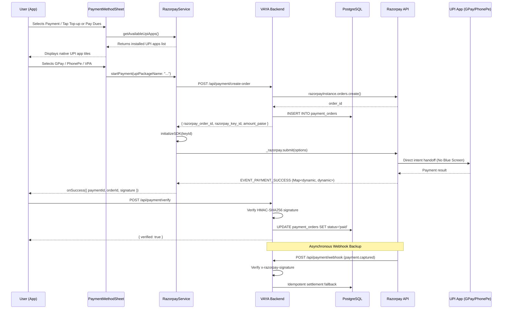

# 💳 VAYA Payment Integration Documentation

**Last Updated:** September 27, 2026  
**Status:** ✅ Razorpay Custom Checkout Active (No Blue Screen)

---

## 1. Overview

The VAYA platform utilizes **Razorpay Custom Checkout** (`razorpay_flutter_customui`) across both mobile applications (`customer_app` and `partner_app`). 

By leveraging Razorpay's Custom Checkout SDK, payment method selection (Google Pay, PhonePe, Paytm, BHIM, manual VPA) occurs natively within custom-styled bottom sheets inside the app. Tapping a payment method directly triggers native UPI app intent handoffs, completely eliminating the default blue Razorpay webview screen.

---

## 2. Directory Structure & Dependencies

```
GoodsDeliveryApp/
├── customer_app/                # Flutter Customer Mobile App
│   ├── pubspec.yaml             # razorpay_flutter_customui: ^1.4.4
│   ├── lib/services/razorpay_service.dart
│   ├── lib/widgets/payment_method_sheet.dart
│   └── lib/main.dart
├── partner_app/                 # Flutter Driver/Partner Mobile App
│   ├── pubspec.yaml             # razorpay_flutter_customui: ^1.4.4
│   ├── lib/services/razorpay_service.dart
│   ├── lib/widgets/payment_method_sheet.dart
│   └── lib/main.dart
└── backend/                     # Node.js / Express API Server
    ├── package.json             # razorpay: ^2.9.8
    ├── server.js                # Raw body parser for webhook signatures
    └── src/routes/payment.routes.js # Order creation, verification, webhooks
```

> [!NOTE]
> `razorpay_flutter` (the standard SDK) is not used anywhere in the codebase. Both mobile apps strictly depend on `razorpay_flutter_customui`.

---

## 3. Architecture & Data Flow



---

## 4. Mobile Client Implementation

### A. Razorpay Service Layer (`razorpay_service.dart`)
Key service methods abstracted in `RazorpayPaymentService`:
- `init({ onSuccess, onError })`: Registers listeners for `EVENT_PAYMENT_SUCCESS` and `EVENT_PAYMENT_ERROR`. Normalizes raw response maps into `Map<String, String>` containing `paymentId`, `orderId`, and `signature`.
- `getAvailableUpiApps()`: Dynamically queries installed UPI apps via `_razorpay.getAppsWhichSupportUpi()` with fallbacks.
- `createOrder()`: Calls backend `/api/payment/create-order` endpoint.
- `submitPayment()`: Invokes `_razorpay.submit(options)` with `upiPackageName` or `upiVpa` parameters.
- `verifyPayment()`: Sends verification payload to backend `/api/payment/verify`.

### B. In-App Payment Bottom Sheet (`payment_method_sheet.dart`)
The `PaymentMethodSheet` provides:
- Auto-detection of installed UPI apps (Google Pay, PhonePe, Paytm, BHIM UPI).
- Tap-to-pay instant intent handoff.
- Manual UPI VPA entry with `@` handle validation.
- VAYA brand styling (Saffron `#FFB800` accenting) and Razorpay security badge.

---

## 5. Backend Implementation (`backend/src/routes/payment.routes.js`)

### Endpoints

1. **`POST /api/payment/create-order`**
   - Protected via JWT auth.
   - Accepts `{ amount, purpose, bookingId }`.
   - Creates order with Razorpay API and logs entry into `payment_orders` database table with `status = 'created'`.

2. **`POST /api/payment/verify`**
   - Protected via JWT auth.
   - Verifies HMAC-SHA256 signature: `HMAC-SHA256(order_id + "|" + payment_id, RAZORPAY_KEY_SECRET)`.
   - Uses `crypto.timingSafeEqual` for secure signature comparison.
   - Enforces user ownership of order and atomic status update (`FOR UPDATE` row lock).
   - Executes purpose-specific settlements (`wallet_topup`, `dues_repayment`, `booking_fare`).

3. **`POST /api/payment/webhook`**
   - Public webhook listener for Razorpay server-to-server events.
   - Validates `x-razorpay-signature` against `RAZORPAY_WEBHOOK_SECRET` using `req.rawBody`.
   - Handles `payment.captured` and `payment.failed` idempotently.

4. **`GET /api/payment/wallet`**
   - Fetches customer wallet balance and transaction ledger history.

---

## 6. Pre-Production Launch Checklist

Before deploying to production environments, verify the following configuration steps:

- [ ] **API Keys**: Replace test keys (`rzp_test_...`) in `backend/.env` with production live keys (`rzp_live_...`).
- [ ] **Secret Manager**: Configure `RAZORPAY_KEY_SECRET` and `RAZORPAY_WEBHOOK_SECRET` in Google Cloud Secret Manager.
- [ ] **Razorpay Webhook**: Register the live backend webhook URL (`https://your-domain.com/api/payment/webhook`) in the Razorpay Dashboard under **Settings → Webhooks**, selecting `payment.captured` and `payment.failed` events.
- [ ] **Client Key Fallback**: Ensure production key IDs are passed dynamically from backend `/create-order` responses so client fallbacks are not relied upon.
